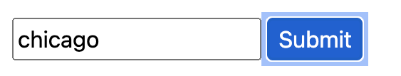
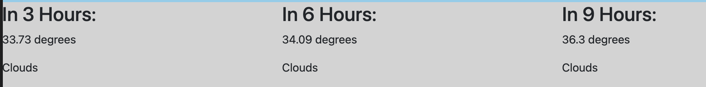
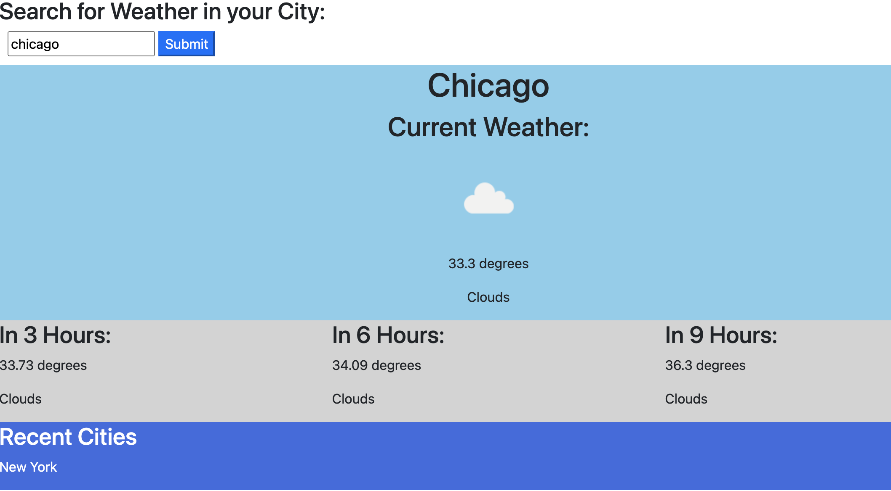

# weather-dashboard

NU Coding Bootcamp Homework: Weather Dashboard

<h1>Contents</h1>
<ol>
<li><a href="#repository">The Repository</a></li>
<li><a href="#weather-dashboard">Weather Dashboard</a></li>
</ol>

<h1 id="repository">The Repository</h1>
The <code>weather-dashboard</code> repository contains HTML, CSS & JavaScript files for a weather dashboard that displays current and forecasted weather for a given city using the 5 Day/ 3 Hour forecast API from <a href="https://openweathermap.org/api">openweathermap.org</a>. The site saves recent searches and displays an icon for the current weather conditions using images, also from openweathermap.org.
<h1 id="weather-dashboard">Weather Dashboard</h1>
My weather dashboard can be found here: <a href="https://emilyalv.github.io/weather-dashboard/.">https://emilyalv.github.io/weather-dashboard/.</a>

Enter a city name to find weather conditions for that city.

View future weather conditions for that city. 

See recent searches.

Full app:
